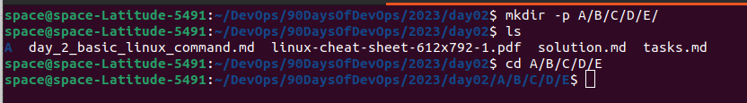

Day 2 Task: Basics linux command

Task: What is the linux command to 
<br>

1. Check your present working directory.

```pwd``` -> present working directory


<br>


2. List all the files or directories including hidden files.

```ls -a``` -> list command will list all files including hidden files 


<br>


3. Create a nested directory A/B/C/D/E

```mkdir -p A/B/C/D/E``` ->  p is used to create parent directory


<br>
